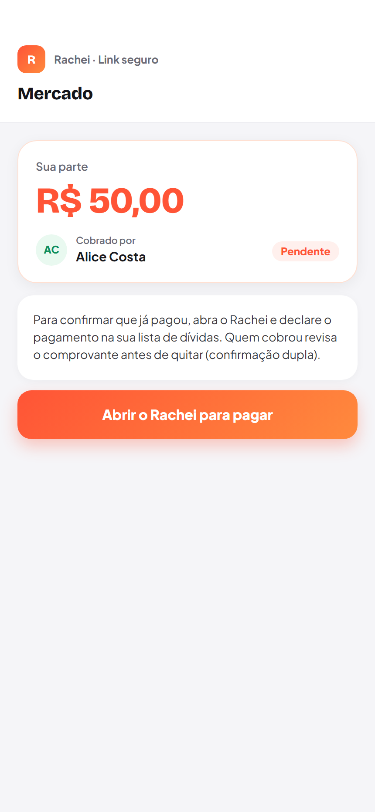
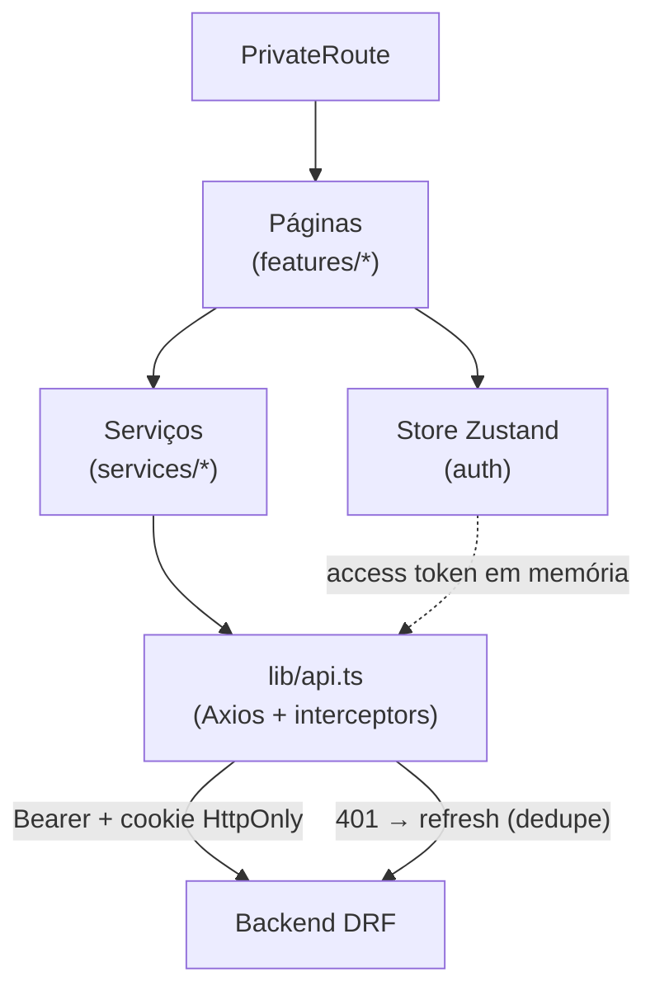

<div align="center">

# 🧡 Rachei — Frontend

**App de divisão de contas entre amigos** (estilo Splitwise) — grupos, dívidas, pagamento com confirmação dupla, compensação de saldos e 2FA. SPA mobile-first que consome a API em [`rachei-backend`](https://github.com/yVilaca/rachei-backend).


</div>

---

## 📱 As telas

<div align="center">

| Login | Dashboard | Grupo |
|:---:|:---:|:---:|
|  |  |  |
| **Detalhe da dívida** | **Acertar contas** | **Cobrança pública** |
|  |  |  |

<sub>Telas reais, capturadas automaticamente com Playwright sobre dados de seed.</sub>

</div>

---

## ✨ Por que este projeto é interessante

- **🔐 Sessão bem desenhada** — o *access token* vive só em memória; o *refresh* fica num cookie `HttpOnly` (fora do alcance de XSS). O interceptor do Axios renova no 401, **deduplica refreshes concorrentes** e encerra a sessão com segurança se o refresh falha — tudo coberto por testes.
- **🧪 Testado de verdade** — **77 testes** de componente/serviço (Vitest + Testing Library + MSW) e **9 fluxos E2E** (Playwright) que abrem o navegador e usam o app contra a stack real.
- **🟦 TypeScript estrito** — zero `any` em produção; camada de serviços que isola o HTTP e mapeia `snake_case ↔ camelCase`.
- **💰 Dinheiro em centavos** no cliente também, com divisão que conserva o total.
- **🚀 Pronto pra produção** — code-splitting por rota (24 chunks), falha explícita se a URL da API não for configurada no build, e Sentry com replay que mascara texto/inputs.

---

## 🏗️ Arquitetura



- **`features/`** — uma pasta por tela (dashboard, grupos, dívidas, pagamento, acerto, perfil, auth).
- **`services/`** — a única camada que fala HTTP; troca de mock→API sem tocar as telas.
- **`stores/`** — estado global (auth) com Zustand; o token não é persistido.
- **`lib/api.ts`** — Axios com os interceptors de sessão (o coração da autenticação).

---

<details>
<summary><b>▶️ Como rodar</b></summary>

<br>

Pré-requisitos: **Node 20+** e a API rodando (ver repo `rachei-backend`).

```bash
pnpm install
cp .env.example .env          # defina VITE_API_URL (ex.: http://localhost:8000)
pnpm dev                      # http://localhost:5173
```

</details>

<details>
<summary><b>🧪 Testes</b></summary>

<br>

```bash
pnpm test                     # Vitest (unit/componente, com MSW)
pnpm test:e2e                 # Playwright (E2E full-stack — sobe backend + frontend)
pnpm lint && pnpm build       # gate de qualidade + build de produção
```

- **Vitest + Testing Library + MSW**: renderiza os componentes reais e mocka só a rede — testa o que o usuário vê.
- **Playwright**: fluxos ponta a ponta contra um Django real com banco descartável.
- **Painel de testes** (em `../test-dashboard`): roda backend, frontend e E2E com resultado ao vivo, drill-down e o Playwright em modo "assistir" (headed/slow-mo).

</details>

---

## 🧰 Stack

| Área | Tecnologia |
|---|---|
| UI | React 19 + TypeScript |
| Build | Vite 8 |
| Rotas | React Router 7 (data router, code-splitting) |
| Estado | Zustand (persistência seletiva) |
| HTTP | Axios (interceptors de auth) |
| Estilo | Tailwind + Radix/shadcn |
| Testes | Vitest + Testing Library + MSW · Playwright |
| Observabilidade | Sentry (erros + replay mascarado) |
