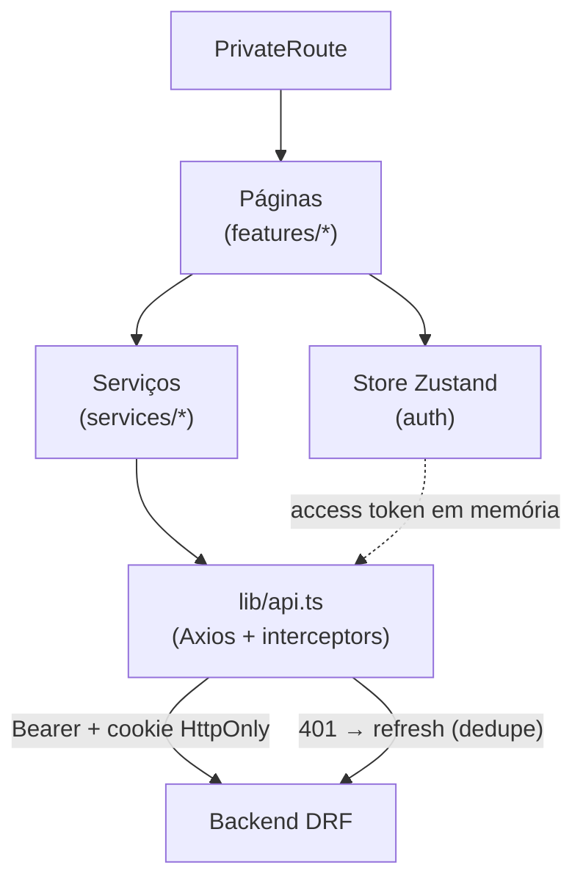

# Rachei — Frontend

Interface do **Rachei**, um app de divisão de contas entre amigos (estilo Splitwise). SPA mobile-first que consome a API em [`rachei-backend`](https://github.com/yVilaca/rachei-backend): grupos, dívidas, pagamento com confirmação dupla, compensação de saldos e 2FA.

**React 19 · Vite 8 · TypeScript · React Router 7 · Zustand · Vitest + Playwright**

<!-- Dica: cole aqui um GIF do fluxo principal (criar dívida → pagar → confirmar → acertar). -->
<!--  -->

---

## Por que este projeto é interessante

- **Sessão bem desenhada**: o _access token_ vive só em memória; o _refresh_ fica num cookie `HttpOnly` (fora do alcance de XSS). O interceptor do Axios renova o token no 401, **deduplica refreshes concorrentes** e, se o refresh falha, encerra a sessão com segurança — tudo coberto por testes.
- **Testado de verdade**: **77 testes** de componente/serviço (Vitest + Testing Library + MSW) e **9 fluxos E2E** (Playwright) que abrem o navegador e usam o app contra a stack real.
- **TypeScript estrito**: zero `any` em código de produção, camada de serviços que isola o HTTP e faz o mapeamento `snake_case ↔ camelCase`.
- **Dinheiro em centavos** no cliente também, com divisão que conserva o total.
- **Pronto para produção**: code-splitting por rota, falha explícita se a URL da API não for configurada no build, e Sentry com replay que mascara texto/inputs (adequado a app financeiro).

---

## Arquitetura (frontend)



- **`features/`** — cada tela num diretório (dashboard, grupos, dívidas, pagamento, acerto, perfil, auth).
- **`services/`** — a única camada que fala HTTP; troca de mock→API sem tocar as telas.
- **`stores/`** — estado global (auth) com Zustand; o token não é persistido.
- **`lib/api.ts`** — Axios com os interceptors de sessão (o coração da autenticação).

---

## Como rodar

Pré-requisitos: **Node 20+** e a API rodando (ver repo `rachei-backend`).

```bash
pnpm install
cp .env.example .env          # defina VITE_API_URL (ex.: http://localhost:8000)
pnpm dev                      # http://localhost:5173
```

---

## Testes

```bash
pnpm test                     # Vitest (unit/componente, com MSW)
pnpm test:e2e                 # Playwright (E2E full-stack — sobe backend + frontend)
pnpm lint && pnpm build       # gate de qualidade + build de produção
```

- **Vitest + Testing Library + MSW**: renderiza os componentes reais e mocka só a rede — testa o que o usuário vê.
- **Playwright**: fluxos de ponta a ponta (login, criar dívida, pagar/confirmar, acertar, cobrança pública) contra um Django real com banco descartável.
- **Painel de testes** (em `../test-dashboard`): uma tela local que roda backend, frontend e E2E com resultado ao vivo, drill-down por teste e o Playwright em modo "assistir" (headed/slow-mo).

---

## Stack

| Área | Tecnologia |
|---|---|
| UI | React 19 + TypeScript |
| Build | Vite 8 |
| Rotas | React Router 7 (data router, code-splitting) |
| Estado | Zustand (com persistência seletiva) |
| HTTP | Axios (interceptors de auth) |
| Estilo | Tailwind + Radix/shadcn |
| Testes | Vitest + Testing Library + MSW · Playwright |
| Observabilidade | Sentry (erros + replay mascarado) |
